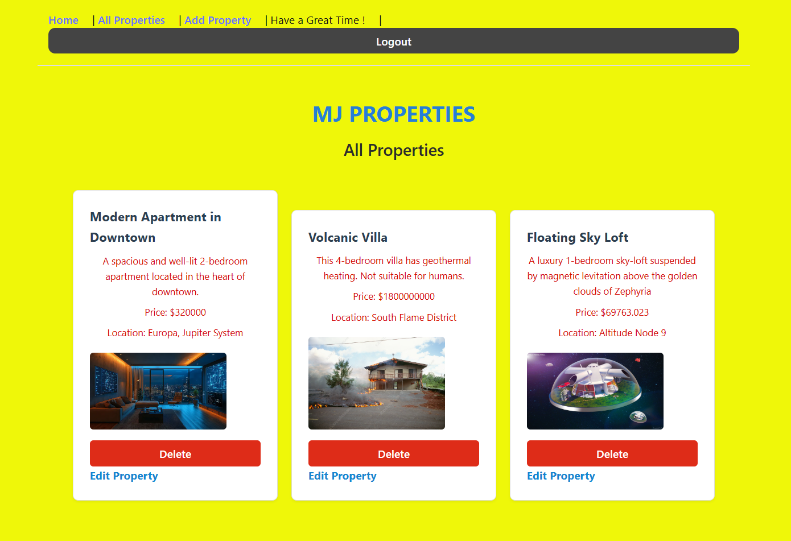

<h1>Real Estate Listings Manager</h1>

<h2>Introduction</h2>

This is a full-stack real estate management application built using the MERN stack (MongoDB, Express.js, React, and Node.js). It allows users to create, read, update, and delete property listings. Each listing includes key details such as location, price, and property images.

